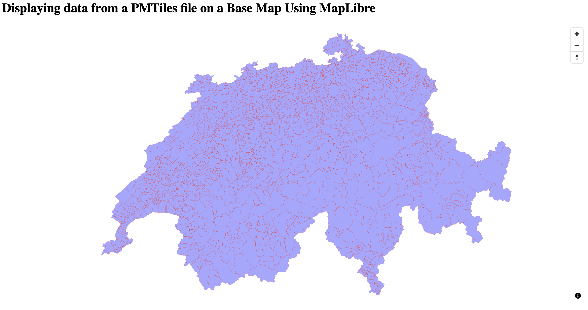

# Use PMTiles for Serverless Rendering of Vector Data on a Map.
This module explains how to display vector data on a map. We follow a serverless approach that hosts a PMTiles files on a AWS S3 storage platform and displays it in our web app that is based on MapLibre. PMTiles is a single-file archive format for pyramids of tiled data. Using HTTP Range Requests the reader can only fetch the relevant tile inside a PMTiles archive on-demand.

## Create PMTiles
We create a PMTiles archive based that contains Swiss ZIP codes. This [Jupyter Notebook](./prepare_vector_tiles.ipynb) provides step-by-step instructions on how to first download the ZIP codes as `.shp` files, then transform them into a suitable geographic projection and ultimately store them as PMTiles. You can either run the notebook on your local machine or on [Google Colab](https://colab.google).

## Upload PMTiles to S3
Once you’ve created your PMTiles file, simply upload it to your AWS S3 bucket (created in the [Getting Started](../README.md) module) by dragging and dropping the file.
[Protomaps documentation](https://docs.protomaps.com/pmtiles/cloud-storage) provides similar resources on how to serve a PMTiles file via AWS S3. In addition, they provide [details](https://docs.protomaps.com/deploy/aws) on creating a CDN-cached ZXY API to boost performance when serving PMTiles.

## Display a PMTiles File on a Base Map Using MapLibre
With the file uploaded to the AWS S3 bucket, we can proceed to visualize the data on the base map we have created in the [first tutorial](../1_simple-map//README.md) of this series. 

As a refresher, in the the [first tutorial](../1_simple-map//README.md) we added a ``div`` element to our html page and linked a ``maplibregl.Map`` object to it. We will keep working with this object, adding a protocol to it that helps us in loading tiles from the file, and rendering data layers on top of the base map.

### Load the PMTiles Protocol

To be able to load our PMTile file, we first need to add the proper protocol to the ``map`` object. That is, we need to add the protocol ``pmtiles`` to the ``map`` object. This can be done by using the [``addProtocol()``](https://maplibre.org/maplibre-gl-js/docs/API/functions/addProtocol/) method of maplibregl, which takes as arguments a protocol type as ``string`` and a [AddProtocolAction()](https://maplibre.org/maplibre-gl-js/docs/API/type-aliases/AddProtocolAction/) function, which is used to register the protocol handler (i.e., the function to use when trying to fetch a tile specified by the protocol). To center our map view around the data, once the protocol is loaded we can fetch the data center coordinates and maximum zoom level from the file header:

```html
<body>
   <!-- code declaring a div goes here -->

  <script>
    // create the protocol and a source to it
    const protocol = new pmtiles.Protocol()
    // add PM Tiles protocol
    maplibregl.addProtocol("pmtiles", protocol.tile)
    // this is the url of your PMTiles file uploaded in the AWS S3 bucket
    const PMTILES_URL = "https://geovizbucket.s3.us-west-2.amazonaws.com/swiss_gemeinden.pmtiles"
    // Associate a PMTiles instance with the protocol
    const p = new pmtiles.PMTiles(PMTILES_URL)
    protocol.add(p)
    
    //  Fetch header to center the map
    p.getHeader().then(header => {
      // here we add a map to the div tagged above
      const map = new maplibregl.Map({
        container: "map",
        style: "https://geovizbucket.s3.us-west-2.amazonaws.com/osm_basempa_style.json",
        center: [header.centerLon, header.centerLat],
        zoom: header.maxZoom - 3
      });
      // add controls here
      // ...
    });
  </script>

</body>
```

### Add PM Tiles Source and Layers
Once the data is loaded, we can proceed to bind the source and layers to our ``map`` which are contained in the PMTiles file. To do so, we use the [``addSource()``](https://maplibre.org/maplibre-gl-js/docs/API/classes/Map/#addsource) and [``addLayer()``](https://maplibre.org/maplibre-gl-js/docs/API/classes/Map/#addlayer) methods of the ``map`` object. While setting up source and layers, it is important to carefully match the id used for the ``source`` with the ``id`` key of each ``layer`` (this example has only one layer). The same should be done for the ``source`` and ``source-layer`` key of each ``layer``. To make sure the base map is loaded _before_ the extra sources and layers are rendered on it, we add the source and layers in the ``onload``callback of the ``maplibregl.Map`` object.

```html
<body>
   <!-- code declaring a div goes here -->

  <script>
    // create the protocol and a source to it
    //...
    const PMTILES_URL = "https://geovizbucket.s3.us-west-2.amazonaws.com/swiss_gemeinden.pmtiles"
    // ...

    // here we add a map to the div tagged above
    //  Fetch header to center the map
    p.getHeader().then(header => {
      const map = new maplibregl.Map({
        container: "map",
        style: "https://geovizbucket.s3.us-west-2.amazonaws.com/osm_basempa_style.json",
        center: [header.centerLon, header.centerLat],
        zoom: header.maxZoom - 3,
      });
      // add controls here
      // ...

      // add source + layers
      map.on('load', () => {
        // add source
        const sourceId = "swiss_gemeinden"
        map.addSource(sourceId, {
          type: "vector",
          url: `pmtiles://${PMTILES_URL}`
        });

        // add layer
        const layerId = "gdf_gemeinden"
        map.addLayer({
          id: layerId,
          source: sourceId,
          "source-layer": layerId,
          type: "fill",
          paint: {
            "fill-color": "blue",
            "fill-outline-color": "red",
            "fill-opacity": 0.3
          }
        });
      });
    });
  </script>

</body>
```

## Putting it All Together
That's it! Display tiled data from a PMTiles files is relatively straightforward and can be achieved in few simple steps. As before, the complete example code used in this tutorial can be found in the [index.html](./index.html) file in this folder. Opening it in a browser should render something like the following image:



## A Vue.js Component to Display a PMTiles File on a Base Map Using MapLibre
Similarly to the [first tutorial](../1_simple-map/README.md), we have prepared a [Vue.js](https://vuejs.org) component that illustrates how to display data from a PMTiles file on a base-map. As done before, we are going to use Vue 3 and its [composition API](https://vuejs.org/guide/introduction.html#composition-api).

The component code closely follows the steps detailed in the HTML case: we add the ``pmtiles`` protocol in the ``onMounted()`` [lifecycle hook](https://vuejs.org/api/composition-api-lifecycle#onmounted) of the component. We then link the protocol to the ``map`` object and finally we add a ``source`` and ``layers` to it.

You can find the complete and documented code for the component in the [Map.vue](./Map.vue) file in this tutorial folder.