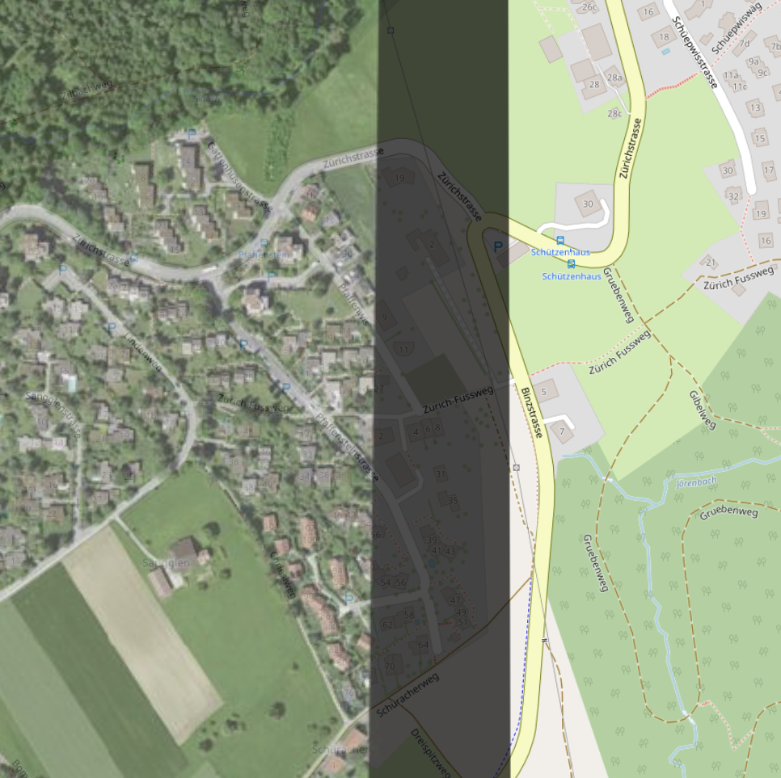

# Use a Cloud Optimized GeoTIFF (COG) File to Display Data on a Map

This tutorial demonstrates how to display raster data on a map. We create and later visualize a Cloud Optimized GeoTIFFs (COGs). 
A COG is a regular GeoTIFF file with an internal organization that enables more efficient workflows on the cloud. 

## Create COG with Jupyter Notebook
This tutorial includes a Jupyter notebook ([prepare_cog.ipynb](./prepare_cog.ipynb)) that processes high-resolution (10cm) aerial photographs of Zurich area and creates a web-optimized COG file suitable for display in MapLibre.

## Upload COG to AWS S3
Once you’ve created your PMTiles file, simply upload it to your AWS S3 bucket (created in the [Getting Started](../README.md) module) by dragging and dropping the file.

## Display a COG File on a Base Map Using MapLibre
With the COG file uploaded to AWS S3, we can proceed to visualize the data on the base map we have created in the [first tutorial](../1_simple-map//README.md) of this series. 

One important note is that to correctly load the COG protocol we must load the correct MapLibre script in the Head of our HTML page:

```html
<head>
  <title>GeoViz: Displaying data from a PMTiles file on a Base Map Using MapLibre</title>
  ...
  <script src="https://unpkg.com/@geomatico/maplibre-cog-protocol/dist/index.js"></script>
  ...
</head>
```

### Load the COG Protocol

Similarly to the [PMTiles tutorial](../2_PMTiles-map/), the first step to load data from a COG file is to add the correct protocol to the ``map`` object in our HTML page. This, as before, can be done by using the [``addProtocol()``](https://maplibre.org/maplibre-gl-js/docs/API/functions/addProtocol/) method of maplibregl.

```html
<body>
   <!-- code declaring a div goes here -->

  <script>
    // create the protocol and a source to it
    maplibregl.addProtocol('cog', MaplibreCOGProtocol.cogProtocol);
    
    // create the map container
    const map = new maplibregl.Map({
      container: 'map', // this is the id referring to the "div" in our page body
      style: 'https://geovizbucket.s3.us-west-2.amazonaws.com/osm_basempa_style.json', // this is the style used to load the basemap
      center: [8.542810246023732, 47.371741515957304],
      zoom: 12
    });

    // add zoom and rotation controls to the map.
    map.addControl(new maplibregl.NavigationControl({
      visualizePitch: true,
      visualizeRoll: true,
      showZoom: true,
      showCompass: true
    }));

  </script>

</body>
```

### Add COG Source and Layers
The steps of adding a source and layer to our map closely follow the ones we already saw for the [PMTiles tutorial](../2_PMTiles-map/). We will be using the [``addSource()``](https://maplibre.org/maplibre-gl-js/docs/API/classes/Map/#addsource) and [``addLayer()``](https://maplibre.org/maplibre-gl-js/docs/API/classes/Map/#addlayer) methods of the ``map`` object, paying attention to match the source ID and layer ID with the ones declared in COG file we are going to load.

Maplibre has an excellent documentation. To find out more about raster sources for COG files, please refer to the ``raster`` section of the [Sources documentation](https://maplibre.org/maplibre-style-spec/sources/#raster). Similarly, to find out more about raster Layers and how to style them (e.g., change the opacity or add more rendering options to the layer ``paint`` object) please refer to the [Layers documentation](https://maplibre.org/maplibre-style-spec/layers/).

```html
<body>
   <!-- code declaring a div goes here -->

  <script>
    // create the protocol and a source to it
    maplibregl.addProtocol('cog', MaplibreCOGProtocol.cogProtocol);
    
    // create the map container
    ...

    // add zoom and rotation controls to the map.
    ...

    // add source + layers
    map.on('load', () => {
      // add source
      const sourceId = 'imageSource'
      map.addSource(sourceId, {
        type: 'raster',
        url: 'cog://https://geovizbucket.s3.us-west-2.amazonaws.com/output_cog_small_jpeg.tif',
        tileSize: 512,
        minzoom: 5,
        maxzoom: 20
      });

      // add layer
      const layerId = 'imageLayer'
      map.addLayer({
        id: layerId,
        source: sourceId,
        type: 'raster',
        paint: {
          'raster-opacity': 0.7
        }
      });
    });

  </script>

</body>
```

## Putting it All Together
That's it! Display tiled data from a COG file is relatively straightforward and can be achieved in few simple steps. As before, the complete example code used in this tutorial can be found in the [index.html](./index.html) file in this folder. Opening it in a browser should render something like the following image:


Zooming on an edge between the base map and the COG data overlay, one can see the alignment of the two:



## A Vue.js Component to Display a PMTiles File on a Base Map Using MapLibre
As for the [second tutorial](../2_PMTiles-map/) we are going to illustrate how to achieve the same steps detailed above in a [Vue.js](https://vuejs.org/) component, using Vue 3 and its [composition API](https://vuejs.org/guide/introduction.html#composition-api). Also for this case the steps for displaying data from a COG file on a base-map using a Vue component are the same as the ones detailed for the HTML case: we add the ``cog`` protocol in the ``onMounted()`` [lifecycle hook ](https://vuejs.org/api/composition-api-lifecycle#onmounted) of the component. We then link the protocol to the ``map`` object and we finally add a ``source`` and ``layers` to it.

The complete and documented code for the component is listed in the [Map.vue](./Map.vue) file in this tutorial folder.